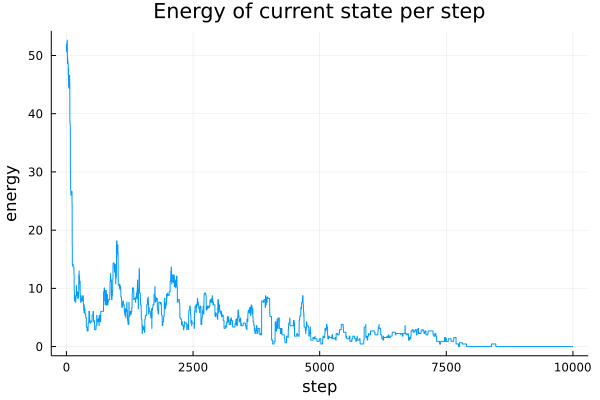

# Simulated Annealing in Julia
A small package that implements the Simulated Annealing algorithm in Julia. 

## Example
`SortingExample.jl` contains a small example of sorting a list using the SA algorithm. An example of the energy per step during training is shown below:

